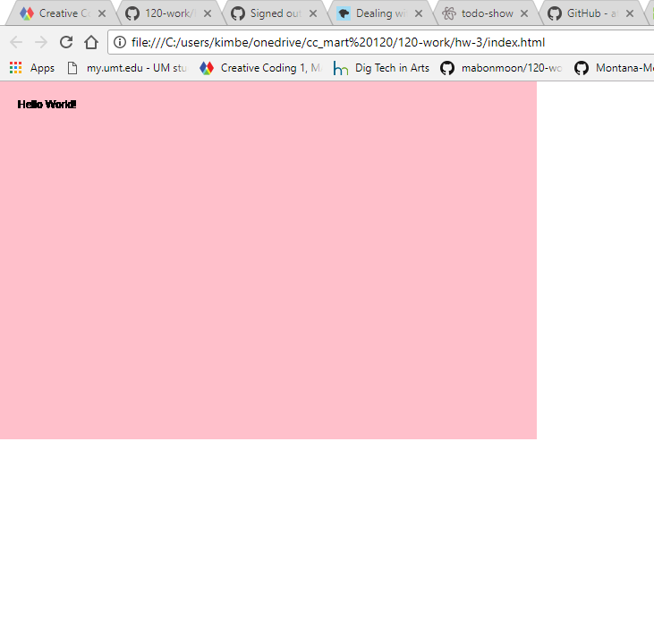

### Kimberly Pierson
---
### ["Hello World!" Sketch](https://mabonmoon.github.io/120-work/hw-3/)
---
# HW-3 Response

I was pretty thrilled when I watched the [http://hello.p5js.org](http://hello.p5js.org) video and began to imagine the creative possibilities of learning this code world. I love the idea of interactive artwork, and when I was able to roll my fingers across the screen and those lines and sounds were happening I was like a little kid on Christmas.

These first few weeks have been an abundance of new information and it is so exciting to be learning all of this despite that, at times, it is utterly maddening. When I was working on my p5.js sketch I had forgotten one of the curly brackets and thus nothing was showing up when I would view the index.html in my browser. It was very disheartening and I laughed at myself when I realized it was just the missing bracket. I am sure that I will experience a myriad of similar instances in the future, but it is so great when something ‘clicks’ and I realize what I am doing wrong or what is missing (especially in these beginning stages!)

Again this week I went slowly through the module sentence by sentence and video by video. It’s very nice that the videos work through the written steps and vice versa so that if something doesn’t make sense to me either in the video or the written instructions I can reference between the two and find the answer. Thanks!

Looking forward to next week!

