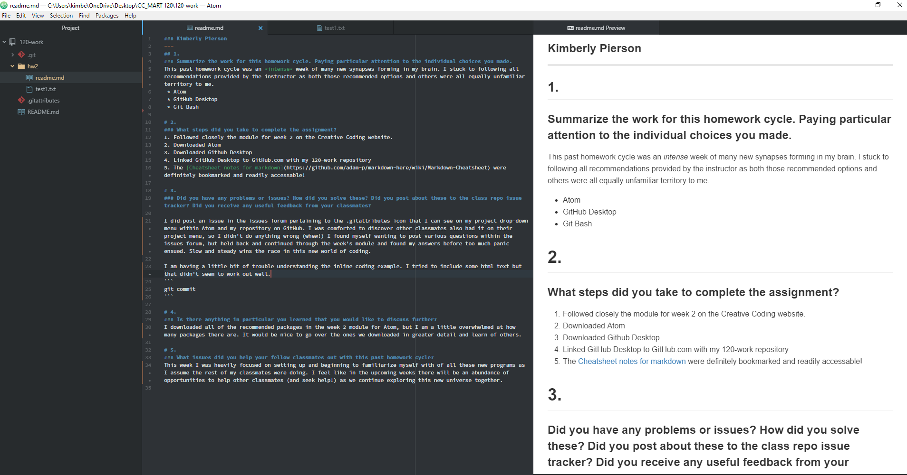

### Kimberly Pierson
---
## 1.
### Summarize the work for this homework cycle.
This past homework cycle was an *intense* week of many new synapses forming in my brain:

* Exploring new programs
 * Atom
 * GitHub Desktop
 * Git Bash
* Working with Markdown
* Making my repository via GitHub for our online assignments.

I stuck to following all recommendations provided by the instructor, Michael Musick, as both those recommended options and others were all equally unfamiliar territory to me.

# 2.
### What steps did you take to complete the assignment?
1. Followed closely the module for week 2 on the Creative Coding website.
2. Downloaded Atom
3. Downloaded Github Desktop
4. Linked GitHub Desktop to GitHub.com with my 120-work repository
5. The [Cheatsheet notes for markdown](https://github.com/adam-p/markdown-here/wiki/Markdown-Cheatsheet) were definitely bookmarked and readily accessable!

# 3.
### Did you have any problems or issues? How did you solve these? Did you post about these to the class repo issue tracker? Did you receive any useful feedback from your classmates?

I did post an issue in the issues forum pertaining to the .gitattributes icon that I can see on my project drop-down menu within Atom and the repository on GitHub:


I was comforted to discover other classmates also had it on their project menu, so I didn't do anything wrong (whew!)

I found myself wanting to post various questions within the issues forum, but held back and continued through the week's module and found my answers before too much panic ensued. Slow and steady wins the race in this new world of coding!

I am still a little confused about the backticks. I assume they have to do with showing our code for explaination purposes.

The example below does _not_ include the html with the backticks

***
<html>
<body>

<p style="font-family:Palatino;">I </p>
<p style="font-family:Courier;">am</p>
<p style="font-family:Lucida Sans Typewriter;">playing</p>
<p style="font-family:Lucida Bright;">with</p>
<p style="font-family:Garamond;">fonts</p>


</body>
</html>

***
The next example _does_ include the backticks and subsequently you can see the code in the Markdown preview. I don't like how it doesn't transfer the various colors over to the Markdown preview and I am uncertain if I am missing something there.

```<html>
<body>

<p style="font-family:Palatino;">I </p>
<p style="font-family:Courier;">am</p>
<p style="font-family:Lucida Sans Typewriter;">playing</p>
<p style="font-family:Lucida Bright;">with</p>
<p style="font-family:Garamond;">fonts</p>

</body>
</html>```

I also found this useful website called [w3schools](www.w3shools.com) which helped me find the above html examples.

***

# 4.
### Is there anything in particular you learned that you would like to discuss further?
I downloaded all of the recommended packages in the week 2 module for Atom, but I am a little overwhelmed at how many packages there are! It would be nice to go over the ones we downloaded in greater detail and learn of others.


# 5.
### What issues did you help your fellow classmates out with this past homework cycle?
This week I was heavily focused on setting up and beginning to familiarize of all these new programs as I assume the rest of my classmates were doing. I feel like in the upcoming weeks there will be an abundance of opportunities to help other classmates (and seek help!) as we continue exploring this new universe together.
